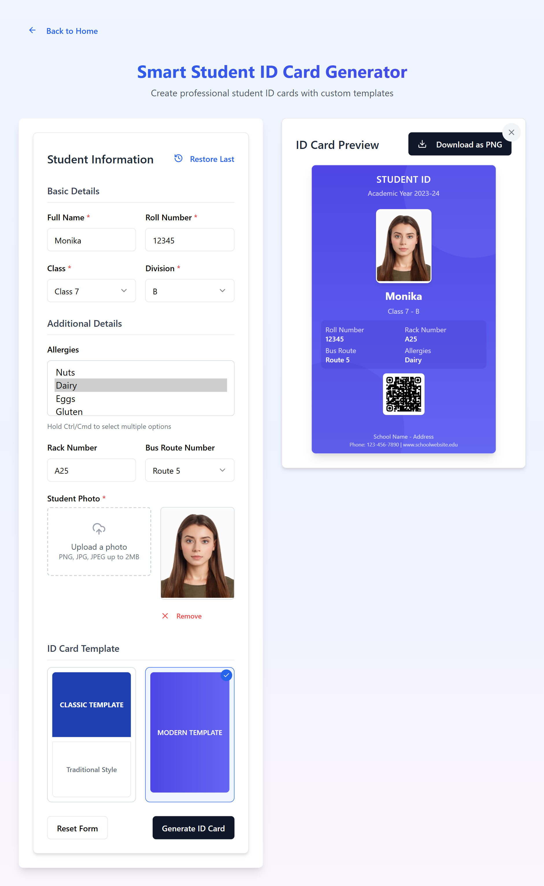
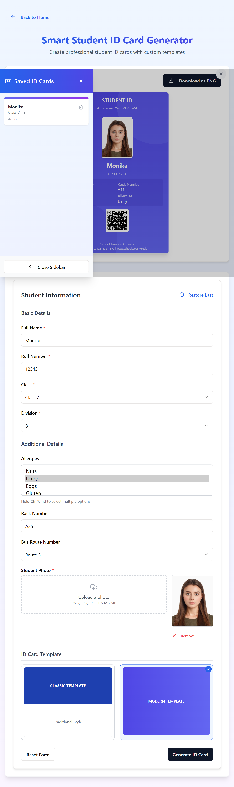

🪪 Student ID Card Generator (Full Stack App)
A full-stack student ID card generation module built using Node.js, Express, Vite, React, and Framer Motion. It allows users to create, view, and delete student ID cards. Developed as part of a recruitment assignment for an internship.

🎯 Features:
- Create new student ID cards

- View a list of generated cards

- Delete existing cards

- Smooth frontend animations using Framer Motion

- Form validation with Zod

- Fast dev setup using Vite

- Clean code architecture

🧑‍💻 Tech Stack:
- Backend: Node.js, Express, TypeScript

- Frontend: React, Vite, TypeScript

- Animations: Framer Motion

- Validation: Zod

- Storage: In-memory (no database)

🚀 Getting Started:
Install dependencies: npm install

Start dev server: npm run dev

Visit: http://localhost:5000

📸 OUTPUT

### Landing page view

### Create New Card

📦 API Endpoints:
- GET /api/cards → Get all cards

- GET /api/cards/:id → Get a card by ID

- POST /api/cards → Create new card

- DELETE /api/cards/:id → Delete a card

📌 Notes:
In-memory storage used (no DB)

Runs on port 5000 (great for Replit)

For production: npm run build (build frontend)

🧾 About:
Built as part of a company’s recruitment task. Highlights full-stack development, validation, and smooth UI handling.